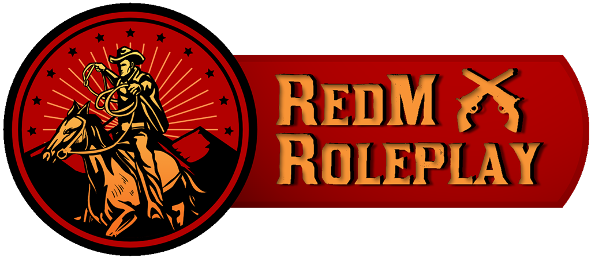
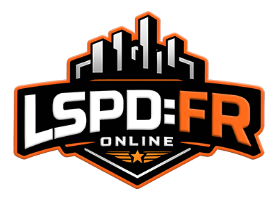

<table align="center" cellspacing="0" cellpadding="10" style="border-collapse: collapse;">
    <tr>
        <td align="center" width="25%">
            
        </td>
        <td align="center" width="25%">
            
        </td>
        <td align="center" valign="middle" rowspan="2" width="50%">
            
        </td>
        </tr>
        <tr>
        <td align="center" width="25%">
            
        </td>
        <td align="center" width="25%">
            
        </td>
    </tr>
    <tr>
        <td align="center" colspan="3">
            
        </td>
    </tr>
</table>
